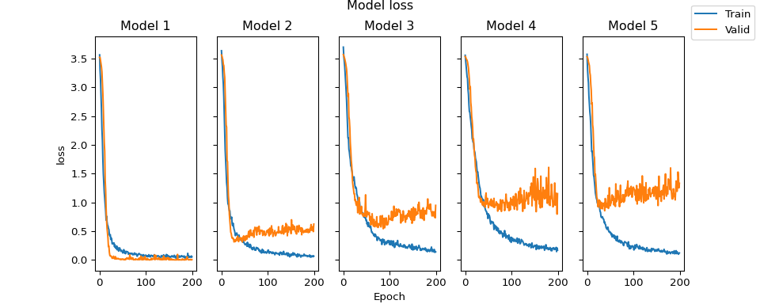
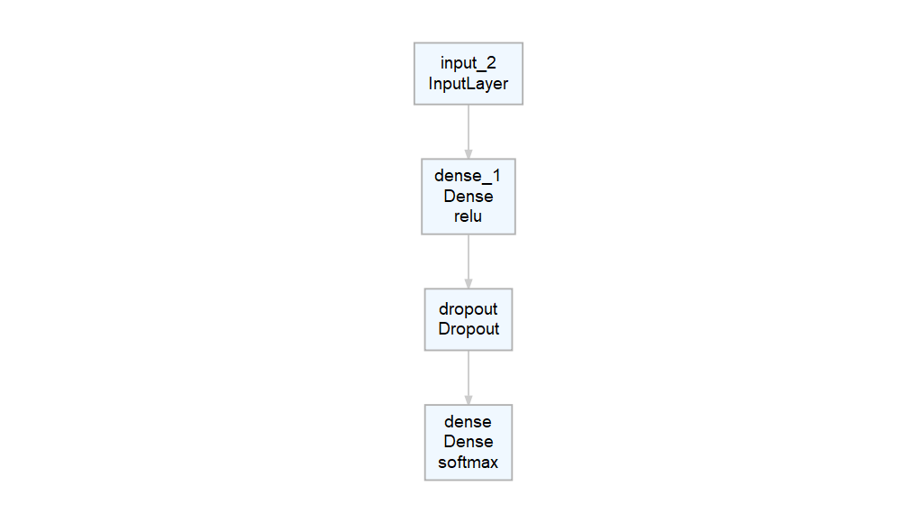
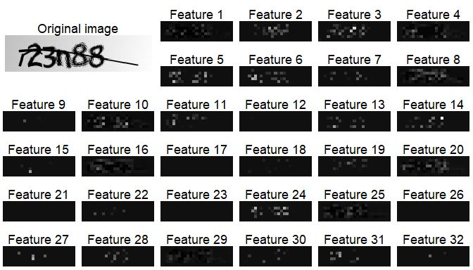
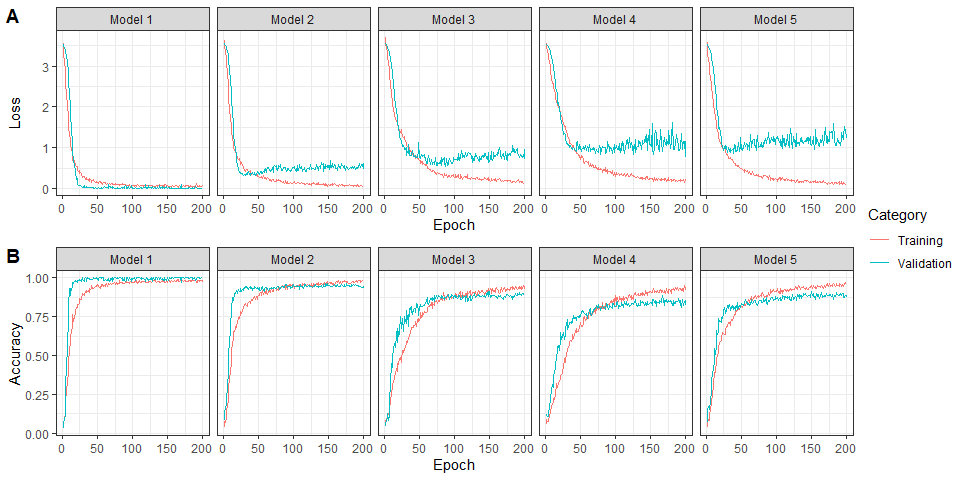
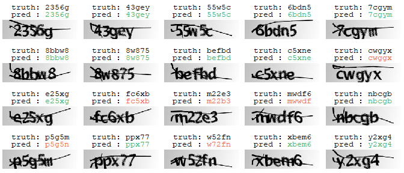

# Breaking Text-Based CAPTCHA with Convolutional Nerual Network (CNN)

**Author**: Xiurui Zhu<br /> **Modified**: 2021-08-26 22:36:30<br />
**Compiled**: 2021-08-26 22:36:33

## Abstract

CAPTCHA is widely used to detect automated spamming on websites. In
recent past, CAPTCHA images usually text-based, consisting of digits and
letters with proper distortion, blurring and noise. With the development
of deep learning, these CAPTCHA images become breakable with
convolutional neural network (CNN), as demonstrated in python. This
paper attempted the process of breaking 5-digit CAPTCHA images in R with
940 samples as training dataset and another 100 ones as testing dataset,
achieving an accuracy of 70%. With the successful prediction of the
CAPTCHA images, more possibilities and challenges were suggested for
further thinking.

## Introduction

CAPTCHA stands for “**C**ompletely **A**utomated **P**ublic **T**uring
test to tell **C**omputers and **H**umans **A**part”. There are mainly
two kinds of CAPTCHA systems, the text-based one and the image-based
one. The text-based CAPTCHA is the earlier version that usually contains
a known number of digits and letters. To escape the detection by optical
character recognition (OCR), the text-based CAPTCHA images usually
contains distortion, blurring and noise (such as random deletion lines).
The text-based images are now being depricated, since they are known to
be breakable by deep learning technology, such as convolutional neural
network (CNN), as demonstrated by [a study in
python](https://medium.com/@manvi./captcha-recognition-using-convolutional-neural-network-d191ef91330e).
This paper will attempt this process in R.

## Methods

### Data preparation

To facilitate the analyses in the paper, we need to load the following
packages: `tidyverse`, `magrittr`, `rlang`, `keras`, `png`, `tools`,
`ggpubr`, `ggtext` and `deepviz`. Please note that the `keras` package
requires a working `tensorflow` R package with python support.

``` r
check_packages <- function(pkg_name, repo = c("cran", "github"), repo_path) {
  repo <- match.arg(repo)
  # Load installed packages
  inst_packages <- installed.packages()
  if (pkg_name %in% inst_packages == FALSE) {
    cat("* Installing: ", pkg_name, ", repo = ", repo, "\n", sep = "")
    switch(repo,
           cran = install.packages(pkg_name),
           github = {
             if ("devtools" %in% inst_packages == FALSE) {
               install.packages("devtools")
             }
             devtools::install_github(repo_path)
           })
  } else {
    cat("* Package already installed: ", pkg_name, "\n", sep = "")
  }
  suppressPackageStartupMessages(
    library(pkg_name, character.only = TRUE)
  )
}

# CRAN packages (load "keras" last to set tensorflow seed right afterwards)
check_packages("tidyverse", repo = "cran")
purrr::walk(.x = c("magrittr", "rlang", "png", "tools",
                   "ggpubr", "ggtext", "keras"),
            .f = check_packages, repo = "cran")
tensorflow::set_random_seed(599L)

# Github packages
purrr::walk2(.x = c("deepviz"),
             .y = c("andrie/deepviz"),
             .f = ~ check_packages(.x, repo = "github", repo_path = .y))
#> * Package already installed: tidyverse
#> * Package already installed: magrittr
#> * Package already installed: rlang
#> * Package already installed: png
#> * Package already installed: tools
#> * Package already installed: ggpubr
#> * Package already installed: ggtext
#> * Package already installed: keras
#> * Package already installed: deepviz
```

Image data from a [5-digit text-based CAPTCHA
dataset](https://www.kaggle.com/fournierp/captcha-version-2-images) were
first loaded with the `samples` folder unzipped and placed under the
current working directory. A total of 1040 png images were turned into
grayscale and put into a three-dimensional array where the first one as
samples, the second one as pixel rows and the third as pixel columns.

``` r
# Load image file names
file_names <- list.files("samples",
                         pattern = "\\.png$",
                         full.names = TRUE,
                         recursive = FALSE)

# Load images (this may take minutes)
data_x <- file_names %>%
  purrr::map(~ .x %>%
               png::readPNG() %>%
               # Select the first 3 color channels as RGB
               `[`(, , 1L:3L, drop = FALSE) %>%
               # Turn the image into grayscale
               apply(MARGIN = 1L:2L, mean, na.rm = TRUE) %>%
               keras::array_reshape(dim = c(dim(.), 1L))) %>%
  # Turn list into array
  purrr::reduce2(.y = 1L:length(.), 
                 .f = function(array., matrix., idx) {
                   array.[idx, , , ] <- matrix.
                   array.
                 },
                 .init = array(0, dim = c(length(.), dim(.[[1L]]))))
print(dim(data_x))
#> [1] 1040   50  200    1
```

Some sample CAPTCHA image were visualized as below.

``` r
# Define a function to convert matrix to ggplot image
matrix2gg_image <- function(
  matrix.,
  decimal = TRUE,
  title = NULL,
  title_style = ggplot2::element_text(hjust = 0.5),
  plot_margin = grid::unit(c(5.5, 5.5, 5.5, 5.5), "points")
  ) {
  mat_rgb <- matrix. %>%
    apply(MARGIN = 1L:2L, function(x) {
      if (length(x) == 1L) {
        color_chr <- rep(x, 3L)
      } else if (length(x) == 3L) {
        color_chr <- x
      } else {
        stop("The third dimension of matrix. should be 1L or 3L")
      }
      color_chr <- color_chr %>%
        .int2hex_color(decimal = decimal) %>%
        paste(collapse = "") %>%
        {paste0("#", .)}
    })
  plot_data <- mat_rgb %>%
    as.data.frame() %>%
    tibble::rowid_to_column("y") %>%
    tidyr::pivot_longer(cols = !c("y"),
                        names_to = "x",
                        values_to = "fill") %>%
    dplyr::mutate_at("x", ~ .x %>%
                       stringr::str_extract_all("[0-9]+") %>%
                       as.numeric()) %>%
    # Reverse y so that image starts from upper left corner
    dplyr::mutate_at("y", ~ min(.x) + max(.x) - .x)
  plot_obj <- ggplot2::ggplot(plot_data, ggplot2::aes(x = x, y = y)) +
    ggplot2::geom_tile(ggplot2::aes(fill = fill),
                       show.legend = FALSE) +
    ggplot2::scale_x_continuous(expand = c(0, 0)) +
    ggplot2::scale_y_continuous(expand = c(0, 0)) +
    ggplot2::coord_equal(ratio = 1) +
    ggplot2::scale_fill_manual(values = plot_data[["fill"]] %>%
                                 unique() %>%
                                 purrr::set_names(.)) +
    ggplot2::theme_void() +
    ggplot2::theme(plot.margin = plot_margin)
  if (is.null(title) == FALSE) {
    plot_obj +
      ggplot2::ggtitle(title) +
      ggplot2::theme(plot.title = title_style)
  } else {
    plot_obj
  }
}
.int2hex_color <- function(x, decimal = TRUE) {
  if (decimal == TRUE) x <- as.integer(x * 255L)
  stopifnot(is.integer(x) == TRUE)
  x %>%
    as.hexmode() %>%
    as.character() %>%
    stringr::str_pad(width = 2L, pad = "0")
}

# Plot sample images
purrr::reduce(.x = c(5L, 246L, 987L),
              .f = ~ {
                .x[[.y]] <- data_x[.y, , , , drop = TRUE]
                .x
              },
              .init = list()) %>%
  purrr::compact() %>%
  purrr::map(matrix2gg_image, decimal = TRUE, title = NULL) %>%
  {gridExtra::arrangeGrob(grobs = ., nrow = 1L)} %>%
  grid::grid.draw()
```


The labels were then loaded from the file names and turned them into a
list of categorical matrices with one digit per element.

``` r
# Define the number of digits and letters per CAPTCHA
digit <- 5L
# Define a dictionary of digits and letters present in CAPTCHA
class_level <- c(0L:9L, letters)

# Define a function to convert character vector to categorical matrix list
labels2matrices <- function(labels, class_level) {
  labels %>%
    stringr::str_extract_all(pattern = ".", simplify = TRUE) %>%
    as.data.frame() %>%
    as.list() %>%
    purrr::set_names(NULL) %>%
    purrr::map(~ {
      factor(.x, levels = class_level) %>%
        as.numeric() %>%
        `-`(1L) %>%
        keras::to_categorical(num_classes = length(class_level))
    })
}

# Process image labels
data_y_labels <- file_names %>%
  basename() %>%
  tools::file_path_sans_ext()
data_y <- data_y_labels %>%
  labels2matrices(class_level = class_level)
print(length(data_y))
#> [1] 5
print(dim(data_y[[1L]]))
#> [1] 1040   36
```

### Modeling

A CNN model was built to break the text-based CAPTCHA. A CNN model
consists of two parts, one as convolutional model and the other as deep
neural-network (DNN) model, joined by a flatten layer. Since there are
multiple digits to predict for each CAPTCHA image, we would build the
model including a common convolutional model, a common flatten layer and
multiple DNN models (one for each digit).

#### Convulutional model

The convolutional model (diagram as below) was built by adding multiple
modules of convolutional and max-pooling layers, optionally adding a
batch-normalization layer to improve model convergence.

``` r
# Define a function that build a module of convolutional and pooling layers
build_unit_conv_layer <- function(input_layer,
                                  filters,
                                  kernel_size,
                                  pool_size,
                                  activation,
                                  kernel_padding,
                                  pool_padding,
                                  batch_norm = FALSE,
                                  ...) {
  conv_layer <- input_layer %>%
    keras::layer_conv_2d(filters = filters,
                         kernel_size = kernel_size,
                         activation = activation,
                         padding = kernel_padding)
  if (batch_norm == TRUE) {
    conv_layer <- conv_layer %>%
      keras::layer_batch_normalization(...)
  }
  conv_layer %>% # input_shape = dim(data_x)[-1L]
    keras::layer_max_pooling_2d(pool_size = pool_size,
                                padding = pool_padding)
}

# Define the convolutional model
input_layer <- keras::layer_input(shape = dim(data_x)[-1L])
conv_model <- keras::keras_model(
  inputs = input_layer,
  outputs = tibble::tribble(
    ~filters, ~kernel_size, ~pool_size, ~activation, ~kernel_padding,
    ~pool_padding, ~batch_norm,
    16L, c(3L, 3L), c(2L, 2L), "relu", "same", "same", FALSE,
    32L, c(3L, 3L), c(2L, 2L), "relu", "same", "same", FALSE,
    32L, c(3L, 3L), c(2L, 2L), "relu", "same", "same", TRUE
  ) %>%
    purrr::pmap(function(...) list(...)) %>%
    purrr::reduce(.f = ~ {
      rlang::inject(build_unit_conv_layer(.x, !!!.y))
    },
    .init = input_layer)
)
deepviz::plot_model(conv_model)
```



``` r
# Define a flatten layer
conv_layer_flatten <- conv_model(input_layer) %>%
  keras::layer_flatten()
```

#### Deep neural network (DNN) models

Each DNN model (diagram as below) was built with a hidden layer and a
dropout layer, with the latter as a regularization method to prevent
overfitting. The output layer of each DNN model adopted a multi-class
configuration with the unit as the number of possibilities per digit and
activation function as `"softmax"`. The input layer of each DNN model
was copied from the shape of the output from the flatten layer.

``` r
# Define a function that copies the shape of a layer and defines an input layer
build_input_layer_like <- function(layer) {
  keras::layer_input(shape = as.integer(keras::k_int_shape(layer)[-1L]))
}

# Define a list of DNN models, one for each digit
deep_models <- purrr::rerun(
  .n = digit,
  build_input_layer_like(conv_layer_flatten) %>%
    keras::keras_model(
      outputs = keras::layer_dense(.,
                                   units = 64L,
                                   activation = "relu") %>%
        keras::layer_dropout(rate = 0.5) %>%
        keras::layer_dense(units = length(class_level),
                           activation = "softmax")
    )
)
print(length(deep_models))
#> [1] 5
deepviz::plot_model(deep_models[[1L]])
```



``` r
# Define output layers
output_layers <- deep_models %>%
  purrr::map(~ {
    .x(conv_layer_flatten)
  })
```

#### Assembled CNN model

The convolutional model and the DNN models were assembled into a final
CNN model (diagram as below) and the final CNN model was compiled for
training.

``` r
# Assemble the final model
model <- keras::keras_model(inputs = input_layer,
                            outputs = output_layers %>%
                              purrr::reduce(c))
print(model)
#> Model
#> Model: "model_6"
#> ________________________________________________________________________________
#> Layer (type)              Output Shape      Param #  Connected to               
#> ================================================================================
#> input_1 (InputLayer)      [(None, 50, 200,  0                                   
#> ________________________________________________________________________________
#> model (Functional)        (None, 7, 25, 32) 14176    input_1[0][0]              
#> ________________________________________________________________________________
#> flatten (Flatten)         (None, 5600)      0        model[0][0]                
#> ________________________________________________________________________________
#> model_1 (Functional)      (None, 36)        360804   flatten[0][0]              
#> ________________________________________________________________________________
#> model_2 (Functional)      (None, 36)        360804   flatten[0][0]              
#> ________________________________________________________________________________
#> model_3 (Functional)      (None, 36)        360804   flatten[0][0]              
#> ________________________________________________________________________________
#> model_4 (Functional)      (None, 36)        360804   flatten[0][0]              
#> ________________________________________________________________________________
#> model_5 (Functional)      (None, 36)        360804   flatten[0][0]              
#> ================================================================================
#> Total params: 1,818,196
#> Trainable params: 1,818,132
#> Non-trainable params: 64
#> ________________________________________________________________________________
deepviz::plot_model(model)
```


``` r
# Compile the final model
model %>%
  keras::compile(optimizer = "adam",
                 loss = "categorical_crossentropy",
                 metrics = c("accuracy"))
```

## Results

### Model training

The final CNN model was trained with 940 images with 20% of them as
cross-validation dataset.

``` r
# Define training dataset
set.seed(999L)
train_idx <- sample.int(dim(data_x)[1L], size = length(file_names) - 100L)
print(length(train_idx))
#> [1] 940

# Train model
model_history <- model %>%
  keras::fit(x = data_x[train_idx, , , , drop = FALSE],
             y = data_y %>%
               purrr::map(~ {
                 .x[train_idx, , drop = FALSE]
               }),
             batch_size = 32L,
             epochs = 200L,
             validation_split = 0.2,
             view_metrics = FALSE)
print(model_history)
#> 
#> Final epoch (plot to see history):
#>                 loss: 0.552
#>         model_1_loss: 0.05332
#>         model_2_loss: 0.06558
#>         model_3_loss: 0.1409
#>         model_4_loss: 0.1702
#>         model_5_loss: 0.1221
#>     model_1_accuracy: 0.9827
#>     model_2_accuracy: 0.9747
#>     model_3_accuracy: 0.9441
#>     model_4_accuracy: 0.9348
#>     model_5_accuracy: 0.9548
#>             val_loss: 4.059
#>     val_model_1_loss: 0.005682
#>     val_model_2_loss: 0.6227
#>     val_model_3_loss: 0.9481
#>     val_model_4_loss: 1.152
#>     val_model_5_loss: 1.331
#> val_model_1_accuracy: 1
#> val_model_2_accuracy: 0.9468
#> val_model_3_accuracy: 0.8883
#> val_model_4_accuracy: 0.8245
#> val_model_5_accuracy: 0.883
```

### Convolutional features

When an image (shown above) went through the convolutional model,
various features were abstracted. For visualization of feature patterns,
the convoluted values were linearly scaled to range \[0,1\] with
positive coefficient and rendered in grayscale (figures as below).

``` r
conv_features <- conv_model %>%
  predict(x = data_x)
print(dim(conv_features))
#> [1] 1040    7   25   32
```

``` r
# Select an image
image_idx <- 5L

# Scale selected convolutional features
sel_conv_features_rescale <- conv_features[image_idx, , , , drop = TRUE] %>%
  scales::rescale(to = c(0, 1))
print(dim(sel_conv_features_rescale))
#> [1]  7 25 32

# Convert selected convolutional matrices into images
conv_plots <- purrr::reduce(
  .x = 1:dim(sel_conv_features_rescale)[3L],
  .f = ~ {
    .x[[.y]] <- sel_conv_features_rescale[, , .y, drop = FALSE]
    .x
  },
  .init = list()
) %>%
  purrr::map2(paste0("Feature ", 1:length(.)), ~ {
    .x %>%
      matrix2gg_image(
        decimal = TRUE,
        title = .y,
        title_style = ggplot2::element_text(
          hjust = 0.5,
          size = 10,
          margin = ggplot2::margin(0, 0, 2, 0, unit = "pt")
        ),
        plot_margin = grid::unit(c(0.5, 3.5, 0.5, 3.5), "points")
      )
  })

# Define layout matrix
layout_matrix <- rbind(
  cbind(
    # Original image
    matrix(rep(1L, 4L), nrow = 2L, ncol = 2L),
    # Convolutional features 1~8
    matrix(2L:9L, nrow = 2L, ncol = 4L, byrow = TRUE)
  ),
  # Convolutional features 9~32
  matrix(10L:33L, nrow = 4L, ncol = 6L, byrow = TRUE)
)
print(dim(layout_matrix))
#> [1] 6 6

# Arrange images
data_x[image_idx, , , , drop = TRUE] %>%
  drop() %>%
  keras::array_reshape(dim = c(dim(.), 1L)) %>%
  matrix2gg_image(
    decimal = TRUE,
    title = "Original image",
    title_style = ggplot2::element_text(
      hjust = 0.5,
      margin = ggplot2::margin(0, 0, 3, 0, unit = "pt")
    ),
    plot_margin = grid::unit(c(3.5, 3.5, 3.5, 3.5), "points")
  ) %>%
  list() %>%
  append(conv_plots) %>%
  {gridExtra::arrangeGrob(
    grobs = .,
    layout_matrix = layout_matrix,
    heights = grid::unit(rep(3, nrow(layout_matrix)), "line")
  )} %>%
  grid::grid.draw()
```



### Model performance

Training history of the final CNN model was revealed in terms of loss
and accuracy (figure as below).

``` r
# Plot training history: loss and metrics
model_history[["metrics"]] %>%
  tibble::as_tibble() %>%
  dplyr::select(dplyr::matches("model_[0-9]+")) %>%
  tibble::rowid_to_column("epoch") %>%
  tidyr::pivot_longer(cols = !c("epoch"),
                      names_to = c("model_name", "metric"),
                      names_sep = "(?<=[0-9])_",
                      values_to = "value") %>%
  dplyr::mutate(
    metric_category = ifelse(stringr::str_starts(model_name, "val_"),
                             "validation",
                             "training")
  ) %>%
  dplyr::mutate_at("model_name", ~ stringr::str_replace(.x, "val_", "")) %>%
  dplyr::mutate_at("metric", ~ factor(.x, levels = unique(.x))) %>%
  split(f = .[["metric"]]) %>%
  purrr::imap(function(plot_data, metric_name) {
    plot_data %>%
      ggplot2::ggplot(ggplot2::aes(x = epoch, y = value)) +
      ggplot2::geom_line(ggplot2::aes(color = metric_category)) +
      ggplot2::facet_wrap(facets = ggplot2::vars(model_name),
                          nrow = 1L) +
      ggplot2::theme_bw() +
      ggplot2::labs(x = "Epoch",
                    y = stringr::str_to_sentence(metric_name),
                    color = "Category")
  }) %>%
  {ggpubr::ggarrange(plotlist = .,
                     ncol = 1L,
                     align = "hv",
                     labels = "AUTO",
                     legend = "right",
                     common.legend = TRUE)}
```



### Model testing

Tested with the remaining 100 images, the final CNN model achieved an
overall accuracy of 70%.

``` r
# Define a function to convert categorical matrix list to character vector
matrices2labels <- function(matrices, class_level) {
  matrices %>%
    purrr::map(~ {
      .x %>%
        apply(MARGIN = 1L, function(x) class_level[which.max(x)]) %>%
        as.character()
    }) %>%
    purrr::pmap_chr(paste0)
}

# Define testing dataset
test_idx <- setdiff(seq_along(file_names), train_idx)
print(length(test_idx))
#> [1] 100

# Derive predictions and convert them to labels
model_pred <- model %>%
  predict(x = data_x[test_idx, , , , drop = FALSE]) %>%
  matrices2labels(class_level = class_level)

# Derive overall accuracy
model_accuracy <- purrr::map2_lgl(
  .x = model_pred,
  .y = data_y_labels[test_idx],
  .f = identical
) %>%
  mean()
print(model_accuracy)
#> [1] 0.7
```

Below were the prediction results of some example images from the
testing dataset.

``` r
# Define a function to plot images and print the truth and the prediction
display_pred_example <- function(data, pred, truth, index) {
  # Decide whether the prediction is correct
  pred_correct <- identical(pred[index], truth[index])
  # Format an HTML-style plot title
  plot_title <- paste0(
    "truth: ", truth[index], "<br>",
    "pred : ", "<span style = 'color:",
    if (pred_correct == TRUE) "MediumSeaGreen" else "Tomato", "'>",
    pred[index], "</span>"
  )
  data[index, , , , drop = TRUE] %>%
    matrix2gg_image(
      decimal = TRUE,
      title = plot_title,
      title_style = ggtext::element_markdown(
        family = "mono",
        hjust = 0.5,
        size = 10,
        margin = ggplot2::margin(0, 0, 3, 0, unit = "pt")
      ),
      plot_margin = grid::unit(c(3.5, 3.5, 3.5, 3.5), "points")
    )
}

# Display some prediction results
model_truth <- data_y_labels[test_idx]
model_correct_lgl <- purrr::map2(model_pred, model_truth, identical)
purrr::map(seq(2L, 97L, by = 5L), ~ {
  display_pred_example(data = data_x[test_idx, , , , drop = FALSE],
                       pred = model_pred,
                       truth = model_truth,
                       index = .x)
}) %>%
  {gridExtra::arrangeGrob(grobs = ., ncol = 5L)} %>%
  grid::grid.draw()
```



## Discussion

In this paper, we presented a CNN in R that predicts text-based CAPTCHA
images at 70% accuracy. The final model was assembled from a common
convolutional module and 5 DNN modules (one for each digit). This
structure is capable of revealing how the final model was trained as a
set of multi-class models, deriving separate loss and accuracy plots for
each digit.

Over the success of predicting 5-digit text-based CAPTCHA, there are
still some food for thought. For example, will the performance of the
final model improve if we unify the DNN models to enable crosstalks
among weight vectors for different digits? Technically, one can use the
following model as a unified DNN model and reshape `data_y` from a list
to an array. At first thought, more information (resulting in more
trainable parameters when printed) is sure to bring up improvements, but
is it really the case (in terms of validation and testing dataset)? And
why?

``` r
# Reshape the responses to an array for the output of unified model
data_y_union <- purrr::reduce(
  .x = 1:length(data_y),
  .f = ~ {
    .x[, .y, ] <- data_y[[.y]]
    .x
  },
  .init = array(dim = dim(data_y[[1L]]) %>%
                  purrr::prepend(length(data_y), 2L))
)

# Define a unified DNN model
deep_model_union <- build_input_layer_like(conv_layer_flatten) %>%
    keras::keras_model(
      outputs = keras::layer_dense(.,
                                   units = 64L * digit,
                                   activation = "relu") %>%
        keras::layer_dropout(rate = 0.5) %>%
        keras::layer_dense(units = length(class_level) * digit,
                           activation = NULL) %>%
        keras::layer_reshape(target_shape = dim(data_y_union)[-1L]) %>%
        keras::layer_activation(activation = "softmax")
    )
```

Another more challenging exploration is to break text-based CAPTCHA
images without knowing the accurate number of digits. To limit the
complexity of this problem, can we attempt at solving text-based images
with a mixture of 1\~5 digits and/or small letters? Then, how can we
first decide the number of digits in the CAPTCHA image?

## Conclusion

In this paper, a CNN model was built in R to break 5-digit text-based
CAPTCHA. The CNN model comprises a common convolutional model and 5
separate DNN models (one for each digit). The accuracy of the CNN model
on a testing dataset of 100 images was 70% with 200 epochs of training.
Starting from the point of successfully predicting these 5-digit
text-based CAPTCHA images, more structures of the CNN model are worth
exploring and more challenging problems are waiting ahead.

## Session info

This file was compiled with the following packages and versions:

``` r
utils::sessionInfo()
#> R version 4.0.5 (2021-03-31)
#> Platform: x86_64-w64-mingw32/x64 (64-bit)
#> Running under: Windows 10 x64 (build 19042)
#> 
#> Matrix products: default
#> 
#> locale:
#> [1] LC_COLLATE=Chinese (Simplified)_China.936 
#> [2] LC_CTYPE=Chinese (Simplified)_China.936   
#> [3] LC_MONETARY=Chinese (Simplified)_China.936
#> [4] LC_NUMERIC=C                              
#> [5] LC_TIME=Chinese (Simplified)_China.936    
#> 
#> attached base packages:
#> [1] tools     stats     graphics  grDevices utils     datasets  methods  
#> [8] base     
#> 
#> other attached packages:
#>  [1] deepviz_0.0.1.9000 keras_2.4.0        ggtext_0.1.1       ggpubr_0.4.0      
#>  [5] png_0.1-7          rlang_0.4.11       magrittr_2.0.1     forcats_0.5.1     
#>  [9] stringr_1.4.0      dplyr_1.0.7        purrr_0.3.4        readr_2.0.1       
#> [13] tidyr_1.1.3        tibble_3.1.3       ggplot2_3.3.5      tidyverse_1.3.1   
#> 
#> loaded via a namespace (and not attached):
#>  [1] fs_1.5.0           lubridate_1.7.10   webshot_0.5.2      RColorBrewer_1.1-2
#>  [5] httr_1.4.2         backports_1.1.8    utf8_1.1.4         R6_2.4.1          
#>  [9] DBI_1.1.0          colorspace_1.4-1   withr_2.4.1        processx_3.5.1    
#> [13] gridExtra_2.3      tidyselect_1.1.0   curl_4.3           compiler_4.0.5    
#> [17] cli_3.0.1          rvest_1.0.1        xml2_1.3.2         labeling_0.3      
#> [21] scales_1.1.1       callr_3.6.0        tfruns_1.5.0       rappdirs_0.3.3    
#> [25] digest_0.6.25      foreign_0.8-81     rmarkdown_2.3      rio_0.5.27        
#> [29] base64enc_0.1-3    pkgconfig_2.0.3    htmltools_0.5.0    dbplyr_2.1.1      
#> [33] htmlwidgets_1.5.3  readxl_1.3.1       rstudioapi_0.13    farver_2.0.3      
#> [37] visNetwork_2.0.9   generics_0.0.2     jsonlite_1.7.2     tensorflow_2.5.0  
#> [41] zip_2.1.1          car_3.0-11         Matrix_1.3-2       Rcpp_1.0.7        
#> [45] munsell_0.5.0      fansi_0.4.2        viridis_0.5.1      abind_1.4-5       
#> [49] reticulate_1.20    lifecycle_1.0.0    stringi_1.4.6      whisker_0.4       
#> [53] yaml_2.2.1         carData_3.0-4      ggraph_2.0.5       MASS_7.3-53.1     
#> [57] grid_4.0.5         ggrepel_0.8.2      crayon_1.4.1       lattice_0.20-41   
#> [61] cowplot_1.1.1      graphlayouts_0.7.1 haven_2.4.3        gridtext_0.1.4    
#> [65] hms_1.1.0          ps_1.6.0           zeallot_0.1.0      knitr_1.29        
#> [69] pillar_1.6.2       igraph_1.2.6       ggsignif_0.6.2     reprex_2.0.1      
#> [73] glue_1.4.2         evaluate_0.14      data.table_1.13.0  modelr_0.1.8      
#> [77] tweenr_1.0.2       vctrs_0.3.8        tzdb_0.1.2         cellranger_1.1.0  
#> [81] polyclip_1.10-0    gtable_0.3.0       assertthat_0.2.1   ggforce_0.3.3     
#> [85] xfun_0.15          openxlsx_4.2.4     tidygraph_1.2.0    broom_0.7.9       
#> [89] rstatix_0.7.0      viridisLite_0.3.0  DiagrammeR_1.0.6.1 ellipsis_0.3.2
```
